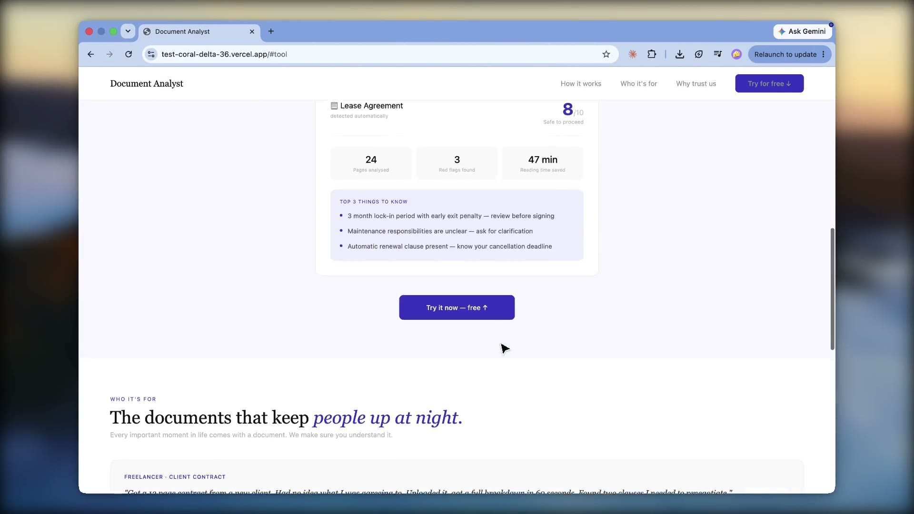

<div align="center">

# Document Analyst

### AI-powered document analysis, directly in your browser.

Document Analyst reads contracts, leases, research papers, and other complex documents and
returns a clear, structured assessment in seconds — a clarity and safety score, a precise
summary, identified risk areas, and answers to any question you raise. It runs entirely in
your browser, secured with your own API key.

[](https://groq.com)
[](https://groq.com)
[](#tech-stack)
[](https://mozilla.github.io/pdf.js/)
[](#architecture)
[](#privacy--security)

</div>

---

## Overview

Important documents are often long, dense, and written in language designed to be hard to
question. Document Analyst closes that gap. Upload a PDF and the document is identified, scored,
and ready to interrogate — before you read a single page. Each analysis is grounded strictly in
the text you provide, producing focused, actionable insight rather than generic commentary.

The application is delivered as a single, self-contained web page. There is no server to deploy,
no account to create, and no build step — open it in a browser and begin.

---

## Demo

<div align="center">

[](https://github.com/tanushreetiwari59/Document-Analyst/raw/main/Doc-Analyst.mp4)

▶️ **[Watch the demo](https://github.com/tanushreetiwari59/Document-Analyst/raw/main/Doc-Analyst.mp4)** — click the image above to play.

</div>

---

## Key Features

| Capability | Description |
|---|---|
| **Automatic classification** | Identifies the document type — contract, lease, research paper, complex document, and more — the moment it is uploaded. |
| **Clarity & safety score** | A 1–10 assessment with a clear verdict: *Safe to proceed*, *Proceed with caution*, or *Review carefully*. |
| **Structured summary** | Distils key points, obligations, dates, and figures into a concise overview with defined next steps. |
| **Plain-language explanation** | Translates dense or technical material into clear, accessible language, section by section. |
| **Risk analysis** | Surfaces concerning clauses as **High** or **Medium** risk, each paired with a recommended course of action. |
| **Targeted questions** | Generates the most important questions to raise before committing, prioritised by significance. |
| **Direct Q&A** | Answers any question you ask, drawing exclusively from the document's content. |
| **Response drafting** | Produces a polished, ready-to-edit message to raise an identified concern with the relevant party. |

---

## Architecture

```
┌──────────────────┐    selectable text    ┌────────────────────┐
│   PDF document   │ ─────────────────────▶│  Text extraction   │
│   (in browser)   │                       │     (pdf.js)       │
└──────────────────┘                       └─────────┬──────────┘
                                                     │ prompt + document
                                                     ▼
                                          ┌──────────────────────┐
                                          │       Groq API       │
                                          │  llama-3.3-70b       │
                                          └──────────┬───────────┘
                                                     │ analysis
                                                     ▼
                          classification · score · summary · risk analysis ·
                                   answers · drafted responses
```

The document is parsed in the browser using **pdf.js**, then analysed by Meta's
`llama-3.3-70b-versatile` model via the **Groq API**. All processing happens client-side; the
only outbound request is the analysis call you initiate.

---

## Getting Started

No installation is required.

1. Download or clone the repository:

   ```sh
   git clone https://github.com/tanushreetiwari59/Test.git
   ```

2. Open `index.html` in any modern browser.
3. Provide your Groq API key when prompted (see [Configuration](#configuration)).
4. Upload a PDF and select an analysis.

To host it, deploy `index.html` to any static host — GitHub Pages, Netlify, or similar.

---

## Configuration

Document Analyst uses a bring-your-own-key model. On first use you will be prompted for a
**Groq API key**, which is stored only in your current browser session and is never written to
the repository or transmitted anywhere other than the Groq API.

Generate a free key from the [Groq Console](https://console.groq.com/keys).

> Treat your API key as a credential. Never commit it to source control or share it publicly.

---

## Privacy & Security

- **No backend.** Documents are never uploaded to or stored on any server operated by this project.
- **Direct provider access.** Document text is sent solely to the Groq API for analysis; refer to [Groq's privacy policy](https://groq.com/privacy-policy/) for data-handling details.
- **Session-scoped key.** Your API key lives only in the active browser tab and is cleared when the session ends.
- **Text-based documents.** Analysis requires selectable text; scanned or image-only PDFs are not supported.

---

## Tech Stack

**Groq** (`llama-3.3-70b-versatile`) · **pdf.js** · **HTML / CSS / JavaScript** — no frameworks, no build pipeline.

> A **Streamlit** implementation (`app.py`) is also included for local use, adding Word (`.docx`)
> support and server-side key handling via a `.env` file.

---

## Usage Note

Document Analyst delivers fast, structured insight to support confident, well-informed
decisions. For legally binding agreements or other high-stakes matters, we recommend using its
analysis alongside review by a qualified professional.

<div align="center">

**Clear answers from complex documents.**

</div>
